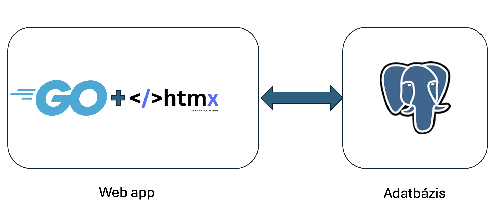
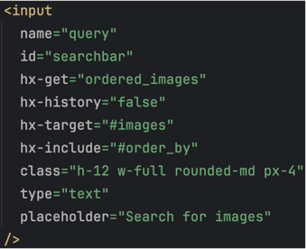
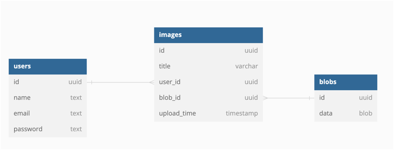

# Felhőalapú elosztott rendszerek laboratórium HF 4. és 5. - Web app PaaS környezetben

### Platform: OpenShift

### Technológiák:
- Go backend, echo framework
- HTMX frontend, TailwindCSS
- Postgres adatbázis

### Előre létrehozott user-ek a kipróbáláshoz:
- Név: alice, jelszó: alice, email: alice@example.com
- Név: bob, jelszó: bob, email: bob@example.com

## Funkciók

- Képek listázása Cím és feltöltési dátum szerint
- Képek keresése cím alapján
- Kép feltöltés
- Bejelentkezés és felhasználó létrehozás
- JWT alapú authentikáció
- Képek megtekintése és saját kép törlése
- Képek és adatok tárolása adatbázisban

## Architektúra

Az alkalmazás két fő részből áll, a Go alapú Web app-ból és egy Postgres adatbázisból. Az adatbázis az OpenShift megfelelő templateje alapján készült, a web app pedig Github repository-ból Dockerfile segítségével lett buildeve és deployolva.



## Web app

### Oldalak

| url           | leírás                          |
|---------------|---------------------------------|
| `/ `          | főoldal                         |
| `/images/:id` | id-hez tartozó kép megtekintése |
| `/login`      | bejelentkező oldal              |
| `/register`   | regisztráló oldal               |

### Endpoint-ok

| method | url              | leírás                                                                                    |
|--------|------------------|-------------------------------------------------------------------------------------------|
| POST   | `/auth/login`    | bejelentkezés                                                                             |
| POST   | `/auth/register` | regisztrálás                                                                              |
| GET    | `/blob/:id`      | id-hez tartozó blob lekérdezése, ez alapján töltődnek be a képek is az `` tag-ekbe |
| POST   | `/upload`        | kép feltöltése                                                                            |
| DELETE | `/images/:id`    | kép törlése                                                                               |

## Frontend - HTMX

Az HTMX egy kliensoldali JS könyvtár, mely visszatér az "alapokhoz". Segítségével HTML-ből érhetünk el modern JS funkciókat pl.: AJAX, WebSocket, SSE

Különböző DOM elemekhez és eseményekhez (pl.: click, hover, blur stb.) kapcsolhatunk hálózati kéréseket, majd az eredményét meg tudja jeleníteni az alkalmazás megadott részein.

JSON válasz helyett, HTML kódot vár és dolgoz fel.

Célja, hogy SPA-szerű élményt nyújtson úgy, hogy csökkenti a klienoldal komplexitását és visszaadja az "irányítást" a szervernek.

### HTMX működése

1. Felhasználó beírja a kép címét a keresőbe
2. A kliens elküldi a query string-et a szervernek HTMX segítségével
3. A szerver az adatbázisból lekérdezi a képeket
4. A szerver elkészíti a HTML sablont a lekérdezett adatokból. Jelen esetben egy `<div>`-et készít `` tag-ekkel feltöltve.
5. A szerver válaszul vissziaküldi a generált HTML kódot a kliensnek
6. A kliens beilleszti a kapott HTML-t a megadott helyre pl az `#images` azonosítójú `<div>` tartalmába.

### HTMX konkrét példa



- `hx-get`: GET kérést küld a `/ordered_images` endpointra
- `hx-target`: megadja, hogy az eredményt hova kell beilleszteni pl.: `#images` belsejébe
- `hx-inclide`: Hozzáadja a kéréshez más inpt mezők értékeit is a saját értéke mellett
- `hx-swap`: Megadja, hogy milyen módon legyen beillesztve a válaszként kapott HTML. Ez lehet pl.: a `hx-target`-ben megadott elem helyett, belsejében, után, előtt stb.
- `hx-on`: Megadja milyen esemény hatására menjen ki a kérés pl.: `click`, `blur`, `hover` stb. Ez input esetén alapértelmezetten a `blur`, gombnál pedig a `click`

## TailwindCSS

A TailwindCSS egy utility osztályokat tartalmazó CSS könyvtár. Előnye, hogy a nem használt osztályok törlődnek, így minimális méretű lesz a végleges CSS fájl. Hátránya, hogy egy build-step szükséges ennek elvégzésére.


```html
<div class="flex gap-x-2 p-2">
  <div class="bg-orange-400 w-16 h-16"></div>
  <div class="bg-orange-400 w-16 h-16"></div>
  div class="bg-orange-400 w-16 h-16"></div>
</div>
```

## Adatbázis

Az adatbázis egy sima Postgres relációs adatbázis 3 táblával: `users`, `images` és `blobs`.
A képfájlo is ebben az adatbázisban vannak tárolva blob-ként. A backend teszi ezeket elérhetővé a `/blobs/:id` endpoint-on.

